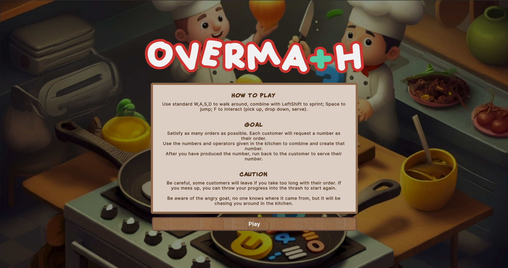
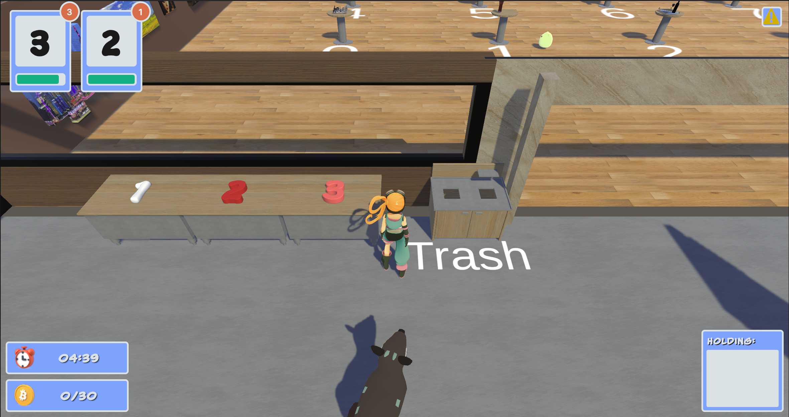
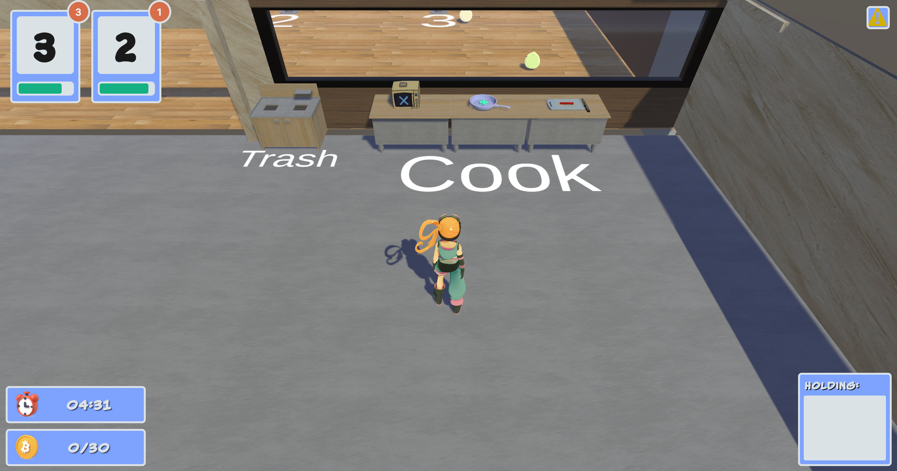
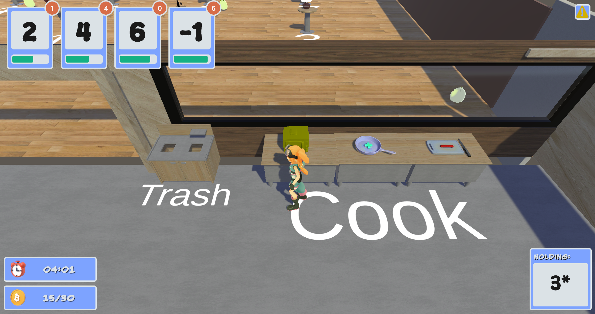
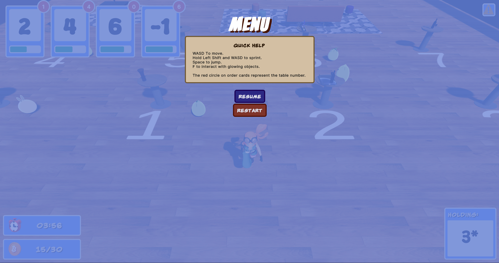
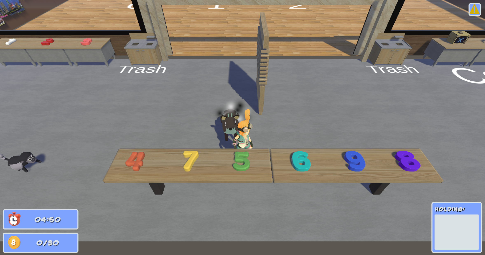
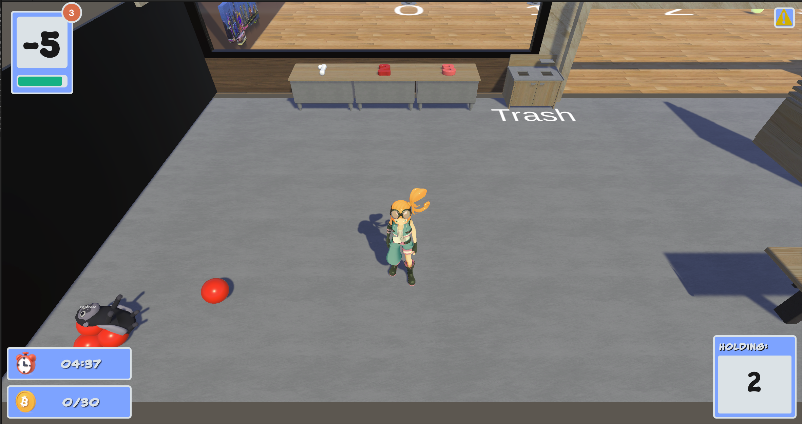

# OverMath - Game Overview

## Instructions

1. **Download Unity** from the [Unity website](https://unity.com/).
2. **Clone this repository** to your local machine.
3. **Open Unity Hub**, click "Add," and select the cloned project folder.
4. **Open the project** in Unity and make sure all dependencies are imported.

You're now ready to play the game!

## Game Description

### Idea and Key Elements
**OverMath** is inspired by the popular game *Overcooked* but with a mathematical twist. Players gather points by creating mathematical equations to fulfill customer orders. Instead of cooking food, players use numbers and mathematical operators to form equations that match customer requests. This fast-paced gameplay tests and hones quick-thinking mathematical skills.

## Movement and Controls
- **Movement**: Use the **WASD** keys to move the character.
- **Sprint**: Hold **Shift** and direction
- **Jump**: Use **SpaceBar** and movement
- **Interact**: Use **F** to interact with objects and customres (pick up, drop, and serve)

Key elements include:
- **Order Fulfillment**: Customers present a number as their "order," and players must create an equation to match that number using available ingredients (numbers and operators) in the kitchen.
- **Adversarial AI**: An animal (a goat) chases and disrupts the player, adding a challenging and humorous obstacle. In later levels, a monkey that tosses balls is introduced to add more tension to the game.
- **Level Progression**: Players advance to the next level by achieving a specified number of points.

### Educational Components
OverMath encourages reverse thinking in math problem-solving. Traditional problems provide an equation to solve, but OverMath requires players to build an equation that yields a given result. This unique approach stimulates mental calculations and creative problem-solving under constraints.

### Target Audience
OverMath is designed for players who enjoy math challenges or want to practice basic mathematical skills in a fun, engaging environment. The game's combination of humor and fast-paced action appeals to people of all ages seeking to sharpen their mental arithmetic.

### Game Engine
OverMath will be developed using the **Unity** engine.

---

## Game Components

### Teaching Focus
The game aims to teach math by encouraging players to think in reverse, building equations to match given answers. This approach helps develop quick calculation skills and deeper mathematical understanding.

### 3D World and Characters
- **Environment**: The game takes place in a closed restaurant environment with a dining area (tables and chairs) and a kitchen.
- **Characters**:
  - **Player**: Navigates the environment, creates equations, and fulfills customer orders.
  - **Adversarial Animal**: A goat or duck that chases the player in the kitchen using AI behaviors such as kinematic pursuit, arrival, and wandering.
  - **Customer NPCs**: Move using path-finding AI to find and occupy empty seats.

### Game Mechanics
- Players can **move, sprint, jump** to evade the adversarial animals.
- Players interact with **ingredients (numbers)** and **tools (operators)** to create equations.
- Orders are **timed**; customers leave if not served in time, resulting in lost points.
- Points are awarded for each successfully completed order. Players must meet a point threshold to progress to the next level.

### Physic/Animation
- Using colliders to detect the interaction range between the main characters and objects such as numbers, operators, and customers, while enhancing the interaction through object highlighting and blinking effects by adding customized "interaction" layer.
- Characters will use **keyframe animations**.
- A **rag-doll, physics-based animation** will be used when the player is head-butted by the animal, adding a humorous and dynamic gameplay element.

### User Interface and Sound
- **Input**: The game will use keyboard input and be available on desktop platforms.
- **UI Elements**:
  - **Pause Menu**: Allows players to pause the game.
  - **Welcome Screen**: Appears at the start of the game.
  - **Failure UI**: Displays when a player fails a level, offering options to quit or retry.
  - **In-Game UI**: Shows active customer orders and the player's current equation.

## Gameplay Snippets

  
  

  
  

  
  

  
  

### Used Assets
- **Enemy Animals**: [Quirky Series Free Animals Pack](https://assetstore.unity.com/packages/3d/characters/animals/quirky-series-free-animals-pack-178235)
- **Customer Slimes**: [Kawaii Slimes](https://assetstore.unity.com/packages/3d/characters/creatures/kawaii-slimes-221172)
- **Player**: [Picochan](https://assetstore.unity.com/packages/3d/characters/humanoids/picochan-220038)
- **Restaurant Assets**: [Fast Food Restaurant Kit](https://assetstore.unity.com/packages/3d/environments/fast-food-restaurant-kit-239419)
- **Player Animations**: [Basic Motions Free](https://assetstore.unity.com/packages/3d/animations/basic-motions-free-154271)
- **Apartment Kit**: [Apartment Kit](https://assetstore.unity.com/packages/3d/environments/apartment-kit-124055)
- **Bit8 Audio**: [8bit Music 062022](https://assetstore.unity.com/packages/audio/music/8bit-music-062022-225623)